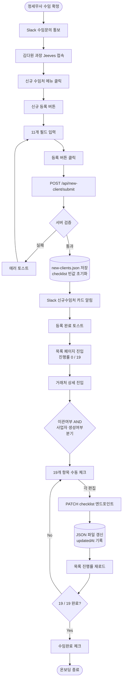
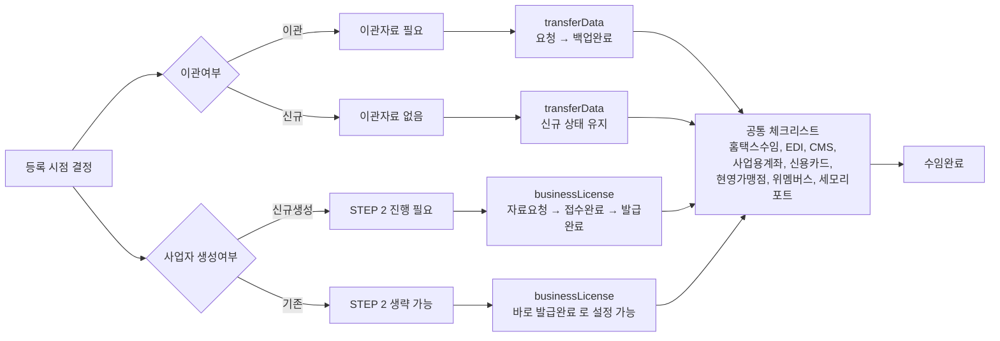
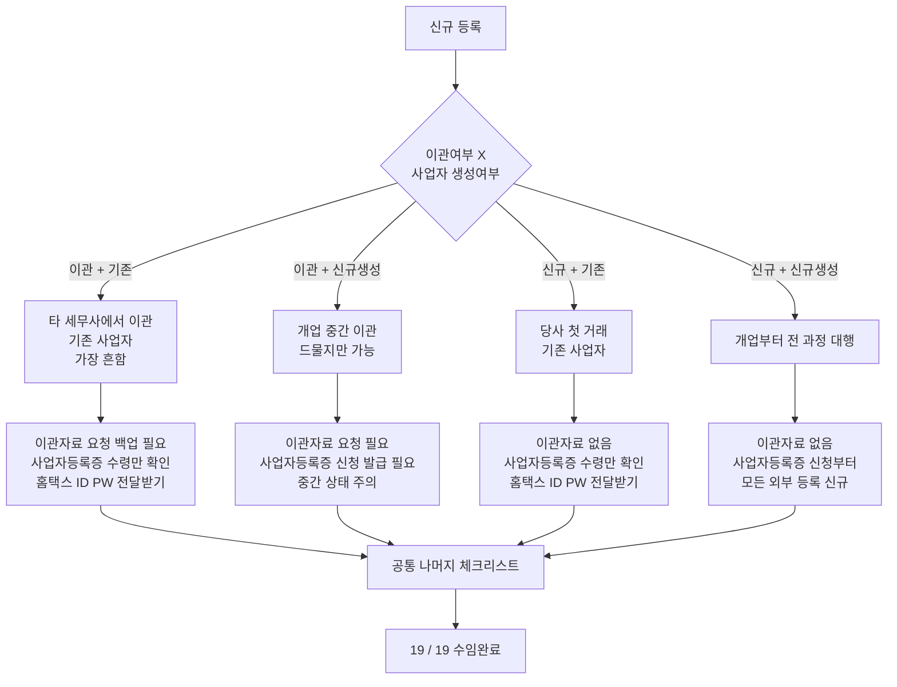
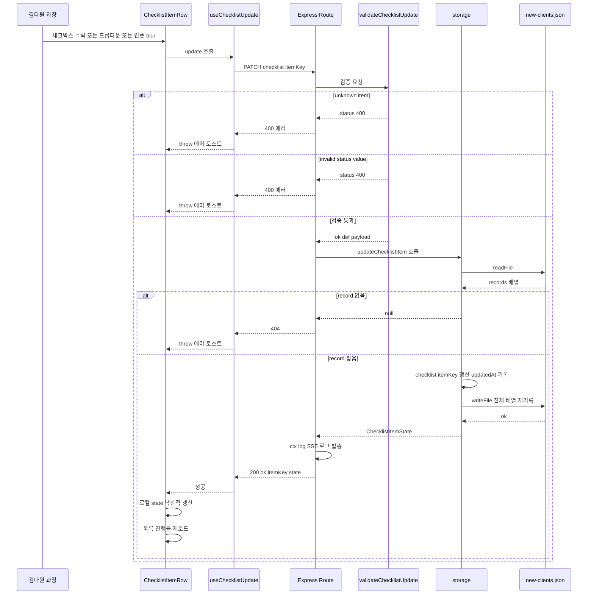
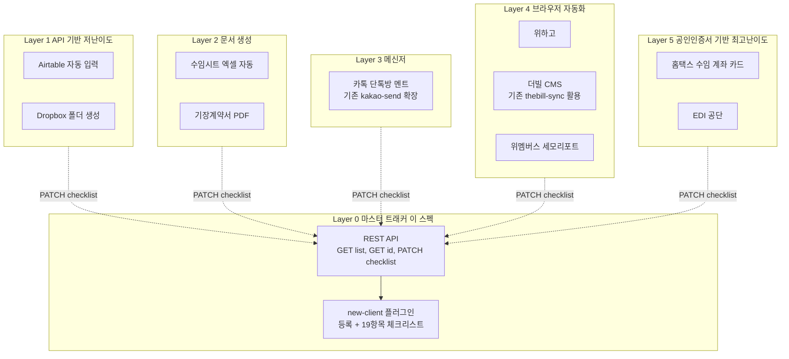

# 신규 수임처 마스터 트래커 — 워크플로우 순서도

> **Spec:** [2026-04-22-new-client-master-tracker-design.md](./2026-04-22-new-client-master-tracker-design.md)
> **Plan:** [../plans/2026-04-22-new-client-master-tracker.md](../plans/2026-04-22-new-client-master-tracker.md)
>
> **뷰어 주의:** Mermaid 8.x 이하 구버전에서는 `{}`, `#`, `()` 안의 특수문자가 파싱 에러를 일으킬 수 있습니다.
> 이 문서는 **Mermaid 9 이상** 호환 문법으로 작성되어 있습니다. 최신 렌더링은 [https://mermaid.live](https://mermaid.live) 또는 GitHub 뷰어를 사용하세요.

---

## 1. 메인 워크플로우 (Slack 통보 → 온보딩 완료)

---

## 2. 등록 필드 분기 → 체크리스트 영향도

---

## 3. 4가지 등록 조합 — 업무 시나리오

---

## 4. 항목 편집 시 기술 흐름 (단건 PATCH)

---

## 5. 전체 플러그인 아키텍처 (향후 Layer 1~5 연결 전망)

